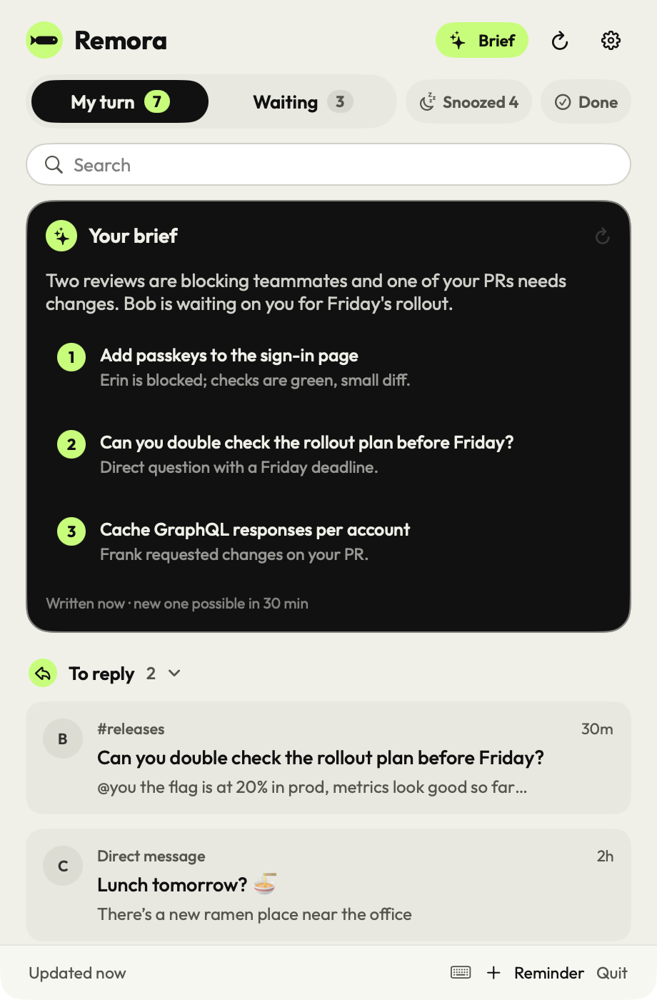
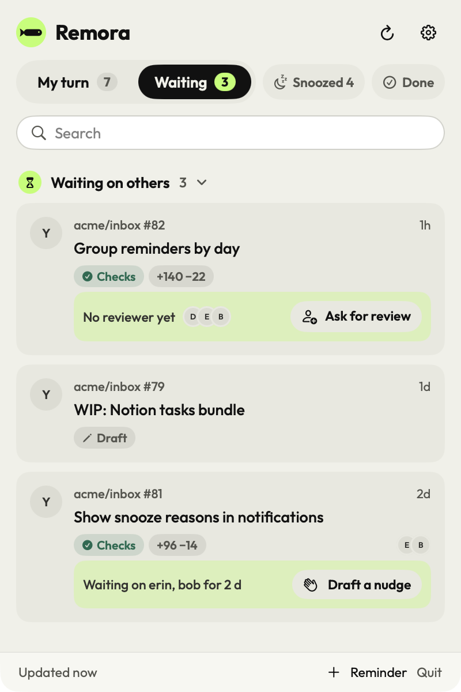
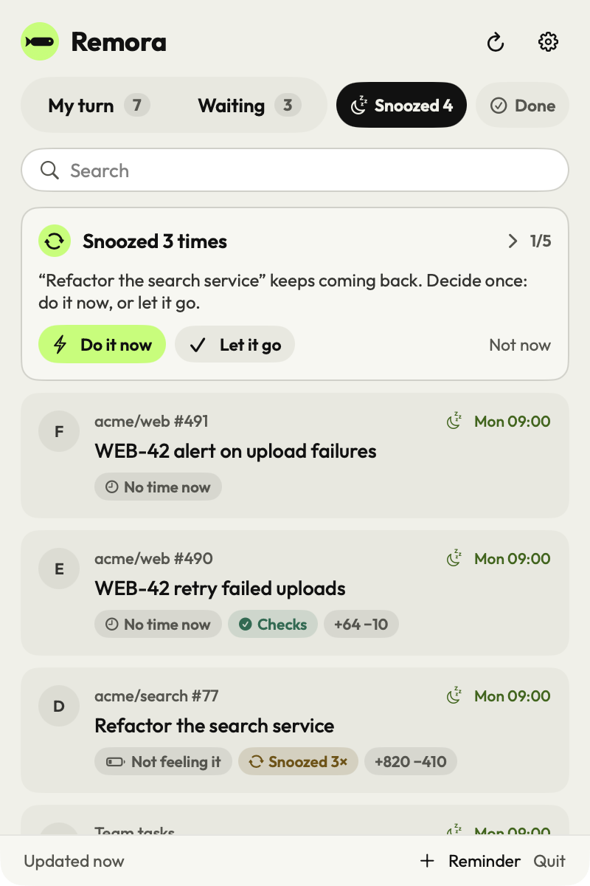

<p align="center">
  
</p>

<h1 align="center">Remora</h1>

<p align="center">
  <strong>Everything that needs you. Nothing that doesn’t.</strong><br />
  <em>Tout ce qui a besoin de vous. Rien de plus.</em>
</p>

<p align="center">
  <a href="https://github.com/iGitScor/triage/actions/workflows/macos.yml"></a>
  <a href="https://github.com/iGitScor/triage/actions/workflows/windows.yml"></a>
  <a href="LICENSE"></a>
  
  
  
</p>

<p align="center">
  <a href="https://github.com/iGitScor/triage/releases/latest/download/Remora.dmg">Download for Mac</a> ·
  <a href="https://triage.iscor.me/en/">Website</a> ·
  <a href="https://triage.iscor.me/docs/">Documentation</a> ·
  <a href="https://triage.iscor.me/docs/admin/">For IT and compliance</a>
</p>

<table>
  <tr>
    <td width="33%">
      <picture><source media="(prefers-color-scheme: dark)" srcset="site/public/site/screens/myturn.en.dark.png" /></picture>
      <br /><sub><b>My turn</b>: what someone waits on you for, by verb</sub>
    </td>
    <td width="33%">
      <picture><source media="(prefers-color-scheme: dark)" srcset="site/public/site/screens/waiting.en.dark.png" /></picture>
      <br /><sub><b>Waiting</b>: suggested reviewers, a drafted nudge</sub>
    </td>
    <td width="33%">
      <picture><source media="(prefers-color-scheme: dark)" srcset="site/public/site/screens/snoozed.en.dark.png" /></picture>
      <br /><sub><b>Snoozed</b>: with a reason, and one insight at a time</sub>
    </td>
  </tr>
</table>

---

Remora is one inbox in your menu bar for everything that needs you: code reviews, your own merge requests, Slack
mentions and DMs, Linear issues and your own reminders. It sorts them by **what you have to do** (*To reply*,
*To review*, *To fix*, *Ready to merge*…), not by where they came from, and shows no more than you can take in.

It is built for teams with strict data rules: **nothing leaves the Mac except to the tools you allow**. There is no
Remora server, no account and no telemetry; sorting, ranking and advice run on the device. Claude can add a short
brief, off by default and only where the organization allows external AI.

Inspired by [gitbar](https://gitbar.app) (merge requests in the menu bar), Gestimer (drag down to set a reminder)
and Google Inbox (bundles, Done, Pin, Snooze). Same design system as [Myna](https://podcast.iscor.me). Built with the
help of [Claude](https://claude.com) (Claude Code, Anthropic's AI assistant).

| Part | What it is | Stack |
|---|---|---|
| **Remora for macOS** [`macos/`](macos) | The menu bar app | Swift 6 (strict concurrency), SwiftUI and AppKit, NaturalLanguage |
| **Remora for Windows** [`windows/`](windows) | The same rules, sources and assistant in a tray app for Windows 10 and 11, in preview: keyword sorting only, [what differs](https://triage.iscor.me/docs/develop/windows) | Rust, Tauri 2, Svelte |
| **Website** [`site/`](site) | Marketing pages in English and French, static on Cloudflare | HTML, CSS, a Python generator |
| **Docs** [`docs/`](docs) | The user guide, IT and compliance, and developer docs, in English and French | VitePress |

## Features

- **My turn / Waiting**: *My turn* holds what someone is waiting on you for (review requests, mentions, DMs, tasks,
  due reminders, and your own merge requests once approved, blocked or failing). *Waiting* holds what you're waiting
  on others for. Snoozed and Done are one click away.
- **Verbs**: *To reply*, *To review*, *To fix*, *Ready to merge*, *To do*, *Reminders*, *To read* (shown last, not
  counted) and *Waiting on others*, whatever the source. Chat messages are sorted on your Mac: keyword rules in
  English and French first, then Apple's on-device sentence embeddings. When unsure, *To reply*.
- **Done** hides an item until something changes on it (new commit, approval, comment…). **Pin** keeps it at the top.
- **Priority**: overdue and due today first, then the tool's priority (Linear Urgent, High…), the nearest due date,
  recent activity. Low priority is shown, not counted. Long bundles show their top five and "Show N more".
- **Menu bar**: one count, or one per tool ordered by the most pressing verb. Click to open, **drag down to cast a
  reminder** (a bubble shows when it comes back; further down is later), right-click for Refresh, New reminder,
  Settings and Quit. Two-finger swipes: right for Done, left for Snooze.
- **Snooze with a reason**: waiting for someone, no time now, needs focus, not urgent, not feeling it. Each reason
  suggests a return time; *waiting* can come back "until there's news". Presets, or a scrubber: minutes, then
  hours, then days. The Snoozed tab shows one insight at a time: loops, pile-ups, items on the same topic
  (on-device word embeddings), items gone quiet.
- **Review prep and sessions**: "~6 min · 4 files · tests ✓ · Auth" under each review request, from file paths
  and line counts only. **Start session** goes through them one by one, quick wins first (⏎ open, D done,
  S snooze, → skip).
- **Links between tools**: a pull request and a Linear issue with a similar title are shown together.
- **Waiting assistant**: suggested reviewers when there are none, a drafted nudge when they stay silent for a day.
  Written locally from templates; you copy it, Remora never sends.
- **Learns your habits** on this Mac: what you handle fast and what you push back breaks ties within a bundle,
  and a small star says why.
- **Notifications** with Done and Snooze buttons: new review requests, mentions and tasks, approvals, changes
  requested, failed checks, due reminders.
- **Opens in the right app**: Slack and Linear items open in their desktop app when it's installed, with the browser
  as fallback.
- **Assistant (optional)**: with Claude Code on your plan, the Claude API or an OpenAI-compatible server, a 3-sentence brief, bundle summaries
  (`claude-haiku-5-5` by default) and triage of the Snoozed tab. Cached, and off unless external AI is allowed.
- **English and French**, following the Mac's language; briefs and summaries come back in that language.

## Sources

| Plugin | What it shows | Credentials |
|---|---|---|
| GitHub (+ Enterprise) | Pull requests you opened, review requests | Classic token: `repo`, `read:org` |
| GitLab (+ self-hosted) | Merge requests you opened or review, approvals, pipelines | Token: `read_api` |
| Slack | Mentions and DMs from the last N days | User token `xoxp-…`: `search:read` |
| Linear | Issues assigned to you (priority, due date), unread mentions and comments | Personal API key |
| Notion | Open tasks assigned to you in chosen databases (Mac only) | Personal access token, or an internal connection's secret |
| Claude Code | Brief, summaries, triage, on your Claude plan | Claude Code signed in on this Mac |
| Claude API | Brief, summaries, triage | Anthropic API key |
| OpenAI-compatible | Brief, summaries, triage | API key and server (OpenAI, Azure, Mistral), or none on a local server |

Accounts can be named ("Work GitLab", "Client Slack"), several per tool. Setup: [connecting your tools](https://triage.iscor.me/docs/guide/connecting-tools).

## Privacy and compliance

- **Declared destinations.** Every plugin declares the hosts it may reach; a test fails if one doesn't.
- **One gate.** Plugins only get an HTTP client limited to their own hosts plus the account's host. Anything else
  fails with "Blocked: … is not an allowed destination", look-alike domains included (tested).
- **External AI off by default.** Claude plugins are refused until it is allowed; then the AI features appear.
- **Managed policy.** IT can lock the allowed tools, external AI and avatars with an MDM configuration profile
  (`fr.igitscor.remora`: `AllowedPlugins`, `AllowExternalAI`, `AllowRemoteImages`); on Windows, under
  `HKLM\SOFTWARE\Policies\Remora`.
- **Local data.** Tokens in one Keychain item; everything else in `~/Library/Application Support/Remora/`.
  Settings → Privacy lists every data flow and erases local data. No telemetry, analytics or crash reporting.

Every flow, the MDM profile and deployment, for IT and compliance teams: [the admin docs](https://triage.iscor.me/docs/admin/).

## Engineering highlights

- **Clean architecture, plugins for every integration.** Domain and rules in `RemoraCore`, sources and assistants
  in `RemoraPlugins`, the app on top. A plugin is a manifest (fields, setup steps, egress) and a `fetch`.
- **On-device ML first.** Keyword rules, then Apple's NaturalLanguage sentence embeddings to sort messages; word
  embeddings and a rare-token check for topic similarity; Naive Bayes for personal ranking and snooze advice.
  Calibrated for precision: a missed group beats a wrong one.
- **Compliance enforced at one point.** A guarded HTTP client per plugin, a policy object readable from MDM, and
  tests for look-alike domains.
- **One spec, two apps.** The Windows app ports the Swift rules and plugins to Rust with the same fixtures and tests;
  `native-tls` uses the Windows certificate store, so corporate root certificates just work.

## Quality

| Suite | Tests | What it covers |
|---|---|---|
| macOS (Swift Testing) | 157 | Verbs and classification in both languages, placement and counts, Done and snooze rules, snooze clock and advice, review prep, links, waiting assistant, ranking; every plugin against fixtures; the compliance gate, link and redirect checks, https-only hosts; the assistant's requests and the `claude` runner; the app layer (connect, saving, erase, disconnect, notifications, MDM policy, the Keychain vault) on a temporary folder |
| Windows (`cargo test`) | 79 | The same rules, the four source plugins against the same fixtures, the guarded client, link and redirect checks, https-only hosts, the registry policy, storage, the inbox service, and what the tray shows |

CI runs each suite when its folder changes, and on demand.

## Getting started

**Download** [Remora.dmg](https://github.com/iGitScor/triage/releases/latest/download/Remora.dmg) (macOS 14 or
later), open it and drag Remora to Applications. It isn't notarized yet: the first time, right-click Remora →
Open (on macOS 15: System Settings → Privacy & Security → Open Anyway).

To build it yourself. Requirements: macOS 14 or later and Xcode 16 (Swift 6 toolchain); Rust ([rustup](https://rustup.rs/)) for the Windows app.

```sh
cd macos
make test                                # unit tests
make run                                 # build build/Remora.app and launch it
open build/Remora.app --args --demo      # sample data in a window, nothing saved

cd windows && cargo test --workspace     # Windows core and plugins
```

Copy `build/Remora.app` to `/Applications` and turn on *Open at login* in Settings.

Working on Remora: [CONTRIBUTING.md](CONTRIBUTING.md). From the repository root, `make test` runs every suite,
`make check` what CI runs, and `make` alone lists the rest (demos, translations, docs, website). Signing and sharing the app:
[building and releasing](https://triage.iscor.me/docs/develop/building).

## Documentation

The documentation is at **[triage.iscor.me/docs](https://triage.iscor.me/docs/)**, in English and French; its sources are in
[`docs/`](docs) (VitePress).

- **Guide**: [getting started](https://triage.iscor.me/docs/guide/getting-started), [connecting your tools](https://triage.iscor.me/docs/guide/connecting-tools),
  [the inbox](https://triage.iscor.me/docs/guide/inbox), [snooze and reminders](https://triage.iscor.me/docs/guide/snooze-and-reminders), [reviews](https://triage.iscor.me/docs/guide/reviews),
  [the assistant](https://triage.iscor.me/docs/guide/assistant), [FAQ](https://triage.iscor.me/docs/guide/faq).
- **For IT and compliance**: [overview](https://triage.iscor.me/docs/admin/), [data flows](https://triage.iscor.me/docs/admin/data-flows),
  [MDM policy](https://triage.iscor.me/docs/admin/mdm), [deployment](https://triage.iscor.me/docs/admin/deployment), [code signing policy](https://triage.iscor.me/docs/admin/code-signing).
- **Developers**: [architecture](https://triage.iscor.me/docs/develop/), [writing a plugin](https://triage.iscor.me/docs/develop/plugins),
  [building and releasing](https://triage.iscor.me/docs/develop/building), [Windows](https://triage.iscor.me/docs/develop/windows),
  [proposal: delegation](https://triage.iscor.me/docs/develop/proposals/delegation).

## Releasing

Set the version (`make version V=0.3.2`), commit, then push the tag `v0.3.2`: [the release
workflow](.github/workflows/release.yml) checks that the tag matches the source, tests and builds both apps (signed
ad hoc for now), and publishes `Remora.dmg` and `Remora-Setup.exe` with their SHA-256, SBOM and signed build provenance in one
GitHub release, only if
both succeed. The download links above always point to the latest one.

## Website

[`site/`](site) holds the marketing pages and, built from [`docs/`](docs), the documentation, served by Cloudflare as static assets (no server code, a strict CSP, no
analytics). The copy lives in [`site/build.py`](site/build.py), which writes the English and French pages:

```sh
macos/scripts/screenshots.sh      # the demo inbox, each tab, both languages and schemes
site/deploy.sh                    # marketing pages, social cards, docs, then Cloudflare
```

## Security

Please report vulnerabilities privately, as [SECURITY.md](SECURITY.md) explains. What changed in each release:
[CHANGELOG.md](CHANGELOG.md).

## License

[GPL-3.0-or-later](LICENSE). Remora bundles the Outfit font (SIL Open Font License 1.1) and tool logos from Simple
Icons (CC0); see [macos/Resources/LICENCES.txt](macos/Resources/LICENCES.txt).
