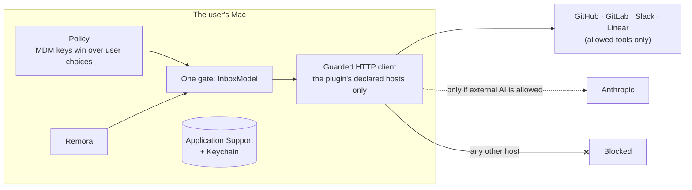

# For IT and compliance

Remora is a Mac menu bar app that reads your people’s work tools (GitHub, GitLab, Slack, Linear) and shows what
needs them. It is built for organizations with strict data rules: **no data leaves the Mac except to the tools the
user, or the organization, allows.**

## In short

| Question | Answer |
|---|---|
| Is there a Remora server or cloud? | No. The app talks directly to the tools; nothing goes through a third party. |
| Accounts, telemetry, analytics, crash reports? | None. |
| What does it send to the tools? | Each user’s own token and read requests. It never writes to the tools. |
| Where is data stored? | On the Mac only: a few JSON files in the user’s Library, tokens in the login Keychain. |
| AI? | On-device only by default (Apple’s NaturalLanguage framework). Claude is opt-in, and can be forbidden. |
| Can IT lock it down? | Yes: allowed tools, external AI and avatars, through a configuration profile. |
| Source code? | Public, GPL-3.0-or-later: [github.com/iGitScor/triage](https://github.com/iGitScor/triage). |

## How it is enforced

1. **Declared destinations.** Every plugin declares, in its manifest, the hosts it may reach and what it sends. A
   test fails if a plugin doesn’t.
2. **One gate.** The app builds plugins in one place. It refuses a plugin the policy doesn’t allow, and gives the
   others an HTTP client limited to their own hosts (plus the account’s host for self-hosted tools). Any other host
   fails with “Blocked: … is not an allowed destination”, look-alike domains included, and that is tested too.
3. **External AI off by default.** Claude plugins are refused until external AI is allowed.
4. **Visible to the user.** Settings → Privacy lists each connected account’s destinations, and erases all local
   data in one click.

## Next

- [Security overview](./security): the answers to a vendor security questionnaire, on one page.
- [Data flows](./data-flows): every flow, what is sent, and what stays on the Mac.
- [Managing the policy with MDM](./mdm): the keys and a ready-to-use configuration profile.
- [Deploying Remora](./deployment): the DMG, signing, and updates.
