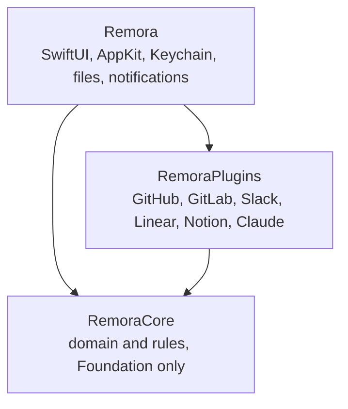

# Architecture

Remora for macOS is a Swift package with three modules (Swift 6, language mode 5). Dependencies point inwards
only. The [Windows app](./windows) ports the same domain and rules to Rust, with the same tests.

## RemoraCore

**Domain** (`Sources/RemoraCore/Domain`)

- `InboxItem`: anything that needs attention. It belongs to a `bundle`, carries `badges`
  (status chips) and `participants` (e.g. reviewers). `needsAction` marks items that ask
  something of you, so their arrival is announced.
- `Badge`: a chip with a `Tone`. A badge with `notify` set triggers a notification the first
  time it appears on an item (e.g. *Approved* on your own MR).
- `InboxBundle`: shared categories (`reviews`, `mentions`, `directMessages`, `authored`,
  `tasks`, `reminders`). Plugins choose one; they never invent UI.
- `ItemState`: what the user decided (pinned, done, snoozed). Stored locally, never sent to a source.
- `Account`: a connected plugin instance. Non-secret settings only.
- `SourcePlugin` / `AssistantPlugin` + `PluginManifest`: the plugin contracts (see [Writing a plugin](./plugins)).
- `CompliancePolicy` and `Egress`: what may leave the Mac (see [Data flows](/admin/data-flows)).

**Application** (`Sources/RemoraCore/Application`)

- `InboxAssembler`: turns items + states into the `InboxLayout` (pinned, bundles, snoozed, done).
- `ChangeDetector`: compares two snapshots of one account and returns `Notice`s.
- `SnoozeClock`: snooze presets and the scrubber's non-linear scale.
- `ReviewPrep` / `ReviewQueue`: size, estimate, tests touched and risk flags from `ChangeSet` paths; session order.
- `PersonalRanker`: Naive Bayes over local `ActionRecord`s (quick vs deferred), with a reason per boost.
- `WaitingAssistant`: reviewer suggestions and local nudge/review-request drafts for your waiting MRs.
- `Prioritizer`: orders a bundle by pressing (overdue/due today), `InboxItem.priority`, `due`, then recency.
- `SnoozeAdvisor`: smart snooze rules over the local `SnoozeRecord` history: return time per
  `SnoozeReason`, best hour (when you usually mark things done), usual return per context, nudges, and
  insights (loop, avoidance, pile-up with `spread`, cluster via `SimilarityModel`s, stale).
  `KeywordSimilarity` (ticket keys, shared words) and `EmbeddingSimilarity` (Infrastructure, Apple word
  embeddings; threshold 1.05 calibrated on title pairs, precision over recall).
- `VerbClassifier`: moves items from the *kind* a plugin reported (mention, DM, your MR) to a *verb*
  bundle (to reply, to read, to fix, ready to merge, waiting on others). Chat text goes through
  `TextIntentClassifier`s in order: `KeywordIntentClassifier` (English and French wording), then
  `EmbeddingIntentClassifier` (Infrastructure, Apple NaturalLanguage sentence embeddings compared with
  example sentences; answers only when the two classes are clearly apart, otherwise *To reply*).

**Infrastructure**: `HTTPClient` (a protocol, so plugins are testable with a stub), `GuardedHTTPClient` (refuses
hosts a plugin doesn’t declare), and JSON helpers.

## Whose turn

*My turn* holds bundles that ask something of you; *Waiting* holds *Waiting on others*. Kinds that were not
classified fall back to `needsAction`. *To read* is in My turn but quiet: not counted in the menu bar, no
arrival notification.

## Inbox rules

Every item has a **fingerprint** (last activity date + badge IDs).

| State | Shown in | Comes back when |
|---|---|---|
| Done | Done tab | its fingerprint changes |
| Snoozed (hide) | Snoozed tab | the time comes, or on new activity if *Bring back early* is on |
| Snoozed (remind) | Inbox | stays visible; a notification fires at the time |
| Pinned | Pinned section | until unpinned |

When a snooze ends, the item is marked with a *Reminder* chip until you open it. Reminder
notifications are scheduled with the system, so they fire even if Remora isn't running.

## Refresh flow

1. `InboxModel` polls every N minutes (and on wake, and when the popover opens after 60 s).
2. Each source account is fetched concurrently through `PluginRegistry.make`.
3. Still in the background, each item goes through `VerbClassifier`. A new message takes about 0.1 s
   with embeddings; answers are cached per message text.
4. On success, `ChangeDetector` diffs against the previous snapshot. The first sync of an
   account is silent, so connecting a source never floods you with notifications.
5. On failure, the last known items stay visible and the error shows in the footer and Settings.

## App

- `App/InboxModel`: the single observable store; actions (done, pin, snooze, connect…).
- `Infrastructure/`: `JSONStore` (Application Support files), `Keychain`, `Notifier`, `Fonts`.
- `Presentation/`: Myna theme (`Theme.swift`), inbox views, settings generated from manifests.
- `Presentation/MenuBar/`: the AppKit status item. A click opens the inbox popover; a drag runs a
  mouse-tracking loop that maps the distance to a time with `SnoozeClock`. The drag bubble (`DragHUD`) is
  plain AppKit because SwiftUI doesn't redraw during that loop; the quick-add box is a SwiftUI floating panel.

Launch flags: `--demo` (sample data, nothing persisted; `--tab waiting` opens on a tab), `--window` (inbox in a
window), `--dark`.
