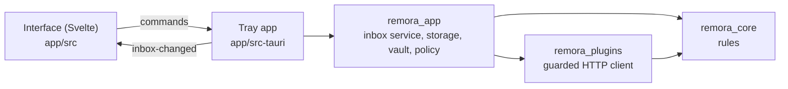

# Remora for Windows

Status: **preview**, for colleagues on Windows. A [Tauri 2](https://tauri.app) tray app: a Rust core and a Svelte
interface on WebView2. It ports the macOS rules and plugins with the same fixtures and tests, so both apps behave the
same. Each release attaches `Remora-Setup.exe` (per-user install, no admin rights needed).

| Part | What | Tests |
|---|---|---|
| `crates/remora_core` | Domain and rules: verbs, My turn / Waiting, prioritizer, Done and snooze rules, change detection, snooze clock, compliance policy | 19 |
| `crates/remora_plugins` | GitHub, GitLab, Slack and Linear, and the HTTP client limited to each plugin’s declared hosts | 12 |
| `crates/remora_app` | Storage, the Credential Manager vault, the registry policy, and the inbox service the tray app drives | 13 |
| `app/src-tauri` | Tray icon and popup, notifications, start with Windows, the reminder shortcut, the commands | |
| `app/src` | The Svelte interface, in English and French | type-checked |

Not yet on Windows: the Claude assistant, smart snooze (reasons and insights), review prep and sessions, the waiting
assistant, and buttons in notifications.

## Same model, Windows equivalents

| | macOS | Windows |
|---|---|---|
| Tokens | Keychain, one item | Credential Manager, one entry |
| Data | `~/Library/Application Support/Remora` | `%LOCALAPPDATA%\Remora` |
| Managed policy | Configuration profile, domain `fr.igitscor.remora` | `HKLM\SOFTWARE\Policies\Remora` (Group Policy, Intune) |
| TLS | System trust | `native-tls`: the Windows certificate store, so corporate root certificates work |
| Reminders | Drag the menu bar fish | A global shortcut (tray icons can’t be dragged) |

## How it fits together



The tray app refreshes every few minutes, and checks every 30 seconds for snoozes and reminders that are due (Windows
can't schedule notifications in advance like macOS). Network calls run without holding the inbox lock, so the
interface never waits on a slow tool.

## Build and test

Requires Rust ([rustup](https://rustup.rs/)) and Node 22.

```sh
cd windows
cargo test                         # the library crates, on any OS
cd app && npm ci
npm run tauri dev -- -- --demo     # sample data in a window
npm run check && npm run build     # type-check and build the interface
node scripts/preview.mjs           # every screen, English and French, light and dark
npm run tauri build                # the installer (on Windows)
```

CI runs the type check, clippy with warnings as errors, every test and the installer build on `windows-latest`.
