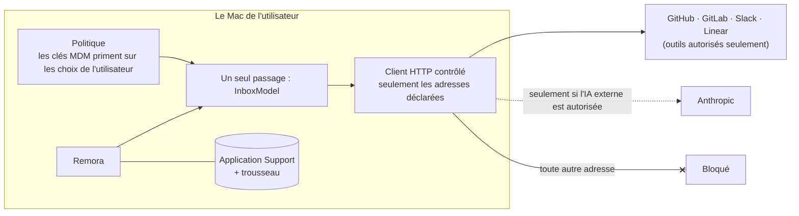

# DSI et conformité

Remora est une app de barre des menus pour Mac qui lit les outils de travail de vos équipes (GitHub, GitLab, Slack,
Linear) et montre ce qui a besoin d’elles. Elle est pensée pour les organisations aux règles strictes sur les
données : **aucune donnée ne quitte le Mac, sauf vers les outils que l’utilisateur, ou l’organisation,
autorise.**

## En bref

| Question | Réponse |
|---|---|
| Y a-t-il un serveur ou un cloud Remora ? | Non. L’app parle directement aux outils ; rien ne passe par un tiers. |
| Comptes, télémétrie, analytics, rapports de plantage ? | Aucun. |
| Qu’envoie-t-elle aux outils ? | Le jeton de chaque utilisateur et des requêtes de lecture. Elle n’écrit jamais dans les outils. |
| Où sont les données ? | Sur le Mac seulement : quelques fichiers JSON dans la Bibliothèque de l’utilisateur, les jetons dans le trousseau de session. |
| Et l’IA ? | Sur l’appareil seulement par défaut (framework NaturalLanguage d’Apple). Claude est facultatif, et peut être interdit. |
| La DSI peut-elle verrouiller ? | Oui : outils autorisés, IA externe et avatars, par un profil de configuration. |
| Code source ? | Public, GPL-3.0-or-later : [github.com/iGitScor/triage](https://github.com/iGitScor/triage). |

## Comment c’est appliqué

1. **Destinations déclarées.** Chaque extension déclare, dans son manifeste, les adresses qu’elle peut joindre et ce
   qu’elle envoie. Un test échoue sinon.
2. **Un seul passage.** L’app construit les extensions à un seul endroit. Elle refuse celles que la politique
   n’autorise pas, et donne aux autres un client HTTP limité à leurs adresses (plus celle du compte pour les outils
   auto-hébergés). Toute autre adresse échoue avec « Bloqué : … n’est pas une destination autorisée », domaines
   imitateurs compris, et c’est testé aussi.
3. **IA externe désactivée par défaut.** Les extensions Claude sont refusées tant que l’IA externe n’est pas
   autorisée.
4. **Visible par l’utilisateur.** Réglages → Confidentialité liste les destinations de chaque compte connecté, et
   efface toutes les données locales en un clic.

## Ensuite

- [Flux de données](./flux-de-donnees) : chaque flux, ce qui est envoyé, et ce qui reste sur le Mac.
- [Gérer la politique par MDM](./mdm) : les clés et un profil de configuration prêt à l’emploi.
- [Déployer Remora](./deploiement) : le DMG, la signature, les mises à jour.
