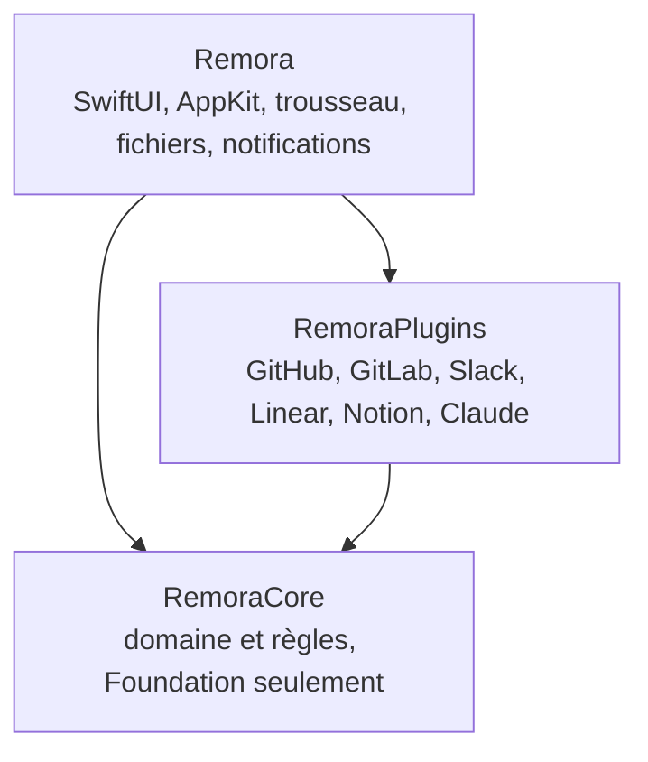

# Architecture

Remora pour macOS est un package Swift en trois modules (Swift 6, avec ses contrôles stricts de concurrence). Les dépendances pointent
uniquement vers l’intérieur. L’[app Windows](./windows) porte le même domaine et les mêmes règles en Rust, avec les
mêmes tests.

## RemoraCore

**Domaine** (`Sources/RemoraCore/Domain`)

- `InboxItem` : tout ce qui demande de l’attention. Il appartient à un `bundle`, porte des `badges` (pastilles de
  statut) et des `participants` (par exemple les relecteurs). `needsAction` marque les éléments qui attendent
  quelque chose de vous : leur arrivée est annoncée.
- `Badge` : une pastille avec un `Tone`. Un badge avec `notify` déclenche une notification la première fois qu’il
  apparaît sur un élément (par exemple *Approuvée* sur votre propre MR).
- `InboxBundle` : les catégories communes (`reviews`, `mentions`, `directMessages`, `authored`, `tasks`,
  `reminders`). Les extensions en choisissent une ; elles n’inventent jamais d’interface.
- `ItemState` : ce que l’utilisateur a décidé (épinglé, terminé, reporté). Stocké en local, jamais envoyé à une
  source.
- `Account` : une instance d’extension connectée. Réglages non secrets seulement.
- `SourcePlugin` / `AssistantPlugin` + `PluginManifest` : les contrats des extensions (voir
  [Écrire une extension](./extensions)).
- `CompliancePolicy` et `Egress` : ce qui peut quitter le Mac (voir [Flux de données](/fr/admin/flux-de-donnees)).

**Application** (`Sources/RemoraCore/Application`)

- `InboxAssembler` : transforme éléments et états en `InboxLayout` (épinglés, groupes, reportés, terminés).
- `ChangeDetector` : compare deux instantanés d’un même compte et renvoie des `Notice`.
- `SnoozeClock` : les durées de report prédéfinies et l’échelle non linéaire du curseur.
- `ReviewPrep` / `ReviewQueue` : taille, estimation, tests touchés et signaux de risque à partir des chemins du
  `ChangeSet` ; ordre de la session.
- `PersonalRanker` : Bayes naïf sur les `ActionRecord` locaux (traité vite ou repoussé), avec une raison pour
  chaque coup de pouce.
- `WaitingAssistant` : suggestions de relecteurs et brouillons locaux de relance ou de demande de relecture pour
  vos MR en attente.
- `Prioritizer` : trie un groupe par urgence (en retard, à rendre aujourd’hui), `InboxItem.priority`, `due`, puis
  ancienneté.
- `SnoozeAdvisor` : les règles de report intelligent sur l’historique local des `SnoozeRecord` : heure de retour
  par `SnoozeReason`, meilleure heure (celle où vous terminez d’habitude), retour habituel selon le contexte,
  relances, et constats (boucle, évitement, accumulation avec `spread`, regroupement via des `SimilarityModel`,
  éléments périmés). `KeywordSimilarity` (clés de tickets, mots communs) et `EmbeddingSimilarity`
  (Infrastructure, embeddings de mots d’Apple ; seuil de 1,05 calibré sur des paires de titres, mieux vaut
  manquer un rapprochement qu’en inventer un).
- `VerbClassifier` : fait passer les éléments du *type* signalé par l’extension (mention, message direct, votre
  MR) à un groupe de *verbe* (à répondre, à lire, à corriger, prête à fusionner, en attente des autres). Le texte
  des messages passe par des `TextIntentClassifier`, dans l’ordre : `KeywordIntentClassifier` (formulations
  anglaises et françaises), puis `EmbeddingIntentClassifier` (Infrastructure, embeddings de phrases
  NaturalLanguage d’Apple comparés à des phrases d’exemple ; il ne répond que lorsque les deux classes sont
  nettement séparées, sinon *À répondre*).

**Infrastructure** : `HTTPClient` (un protocole, pour tester les extensions avec un stub), `GuardedHTTPClient`
(refuse les adresses qu’une extension ne déclare pas), et des utilitaires JSON.

## À qui le tour

*À moi* regroupe ce qui attend quelque chose de vous ; *En attente* regroupe *En attente des autres*. Les types non
classés se rabattent sur `needsAction`. *À lire* est dans À moi mais reste discret : pas compté dans la barre des
menus, pas de notification à l’arrivée.

## Règles de la boîte

Chaque élément a une **empreinte** (date de dernière activité + identifiants des badges).

| État | Affiché dans | Revient quand |
|---|---|---|
| Terminé | Onglet Terminé | son empreinte change |
| Reporté (masquer) | Onglet Reportés | l’heure arrive, ou à la moindre activité si *Faire revenir les éléments reportés en cas de nouvelle activité* est activé |
| Reporté (rappel) | Boîte | reste visible ; une notification part à l’heure dite |
| Épinglé | Section Épinglés | jusqu’à ce qu’on le désépingle |

À la fin d’un report, l’élément porte une pastille *Rappel* jusqu’à ce que vous l’ouvriez. Les notifications de
rappel sont programmées auprès du système : elles arrivent même si Remora n’est pas lancée.

## Actualisation

1. `InboxModel` interroge les sources toutes les N minutes (ainsi qu’au réveil, et à l’ouverture du popover après
   60 s).
2. Chaque compte source est récupéré en parallèle via `PluginRegistry.make`.
3. Toujours en arrière-plan, chaque élément passe par `VerbClassifier`. Un nouveau message prend environ 0,1 s avec
   les embeddings ; les réponses sont mises en cache par texte de message.
4. En cas de succès, `ChangeDetector` compare avec l’instantané précédent. La première synchronisation d’un compte
   est silencieuse : connecter une source ne vous noie jamais sous les notifications.
5. En cas d’échec, les derniers éléments connus restent visibles et l’erreur s’affiche en bas de la boîte et dans
   les Réglages.

## App

- `App/InboxModel` : le seul store observable ; les actions (terminer, épingler, reporter, connecter…).
- `Infrastructure/` : `JSONStore` (fichiers d’Application Support), `Keychain`, `ManagedPolicy`, `Notifier`,
  `Fonts`. `InboxModel` y accède, comme au réseau et à l’ouverture des liens, via `AppEnvironment` : ainsi
  `Tests/RemoraTests` le fait tourner dans un dossier temporaire avec des stand-ins, jamais sur vos données, vos
  jetons ou vos notifications.
- `Presentation/` : thème Myna (`Theme.swift`), vues de la boîte, réglages générés à partir des manifestes.
- `Presentation/MenuBar/` : l’élément AppKit de la barre des menus. Un clic ouvre la boîte dans un popover ; un
  glisser lance une boucle de suivi de la souris qui convertit la distance en heure avec `SnoozeClock`. La bulle
  du glisser (`DragHUD`) est en AppKit pur, car SwiftUI ne redessine pas pendant cette boucle ; la saisie rapide
  est un panneau flottant SwiftUI.

Options de lancement : `--demo` (données d’exemple, rien n’est enregistré ; `--tab waiting` ouvre sur un onglet),
`--window` (la boîte dans une fenêtre), `--dark`.
