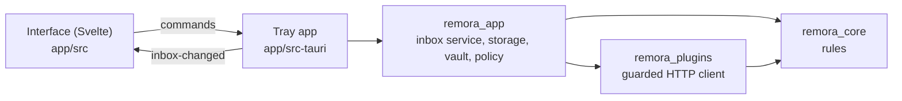

# Remora pour Windows

Statut : **aperçu**, pour les collègues sous Windows. Une app de zone de notification [Tauri 2](https://tauri.app) :
un cœur en Rust et une interface Svelte sur WebView2. Elle reprend les règles et les extensions de macOS avec les
mêmes données de test et les mêmes tests, pour que les deux apps se comportent pareil. Chaque version publiée joint
`Remora-Setup.exe` (installation par utilisateur, sans droits d’administrateur).

| Partie | Contenu | Tests |
## Même modèle, équivalents Windows

| | macOS | Windows |
|---|---|---|
| Jetons | Trousseau, un seul élément | Gestionnaire d’identification, une seule entrée |
| Données | `~/Library/Application Support/Remora` | `%LOCALAPPDATA%\fr.igitscor.remora` |
| Politique gérée | Profil de configuration, domaine `fr.igitscor.remora` | `HKLM\SOFTWARE\Policies\Remora` (stratégie de groupe, Intune) |
| TLS | Confiance du système | `native-tls` : le magasin de certificats Windows, donc les certificats racines de l’entreprise fonctionnent |
| Rappels | Faire glisser le poisson de la barre des menus | Un raccourci global (on ne peut pas faire glisser les icônes de la zone de notification) |

## Comment tout s’assemble



L’app actualise toutes les quelques minutes, et vérifie toutes les 30 secondes les reports et rappels arrivés à
échéance (Windows ne sait pas programmer des notifications à l’avance comme macOS). Les appels réseau se font sans
garder le verrou de la boîte de réception, donc l’interface n’attend jamais un outil lent.

## Construire et tester

Demande Rust ([rustup](https://rustup.rs/)) et Node 22.

```sh
cd windows
cargo test                         # the library crates, on any OS
cd app && npm ci
npm run tauri dev -- -- --demo     # sample data in a window
npm run check && npm run build     # type-check and build the interface
node scripts/preview.mjs           # every screen, English and French, light and dark
npm run tauri build                # the installer (on Windows)
```

La CI lance la vérification de types, clippy avec les avertissements traités comme des erreurs, tous les tests et
la construction de l’installeur sur `windows-latest`.
