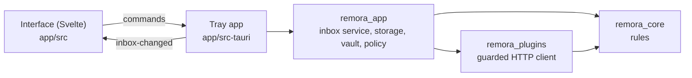

# Remora pour Windows

Statut : **aperçu**, pour les collègues sous Windows. Une app de zone de notification [Tauri 2](https://tauri.app) :
un cœur en Rust et une interface Svelte sur WebView2. Elle reprend les règles et les extensions de macOS avec les
mêmes données de test et les mêmes tests, pour que les deux apps se comportent pareil. Chaque version publiée joint
`Remora-Setup.exe` (installation par utilisateur, sans droits d’administrateur).

| Partie | Contenu | Tests |
|---|---|---|
| `crates/remora_core` | Domaine et règles : verbes, À moi / En attente, priorisation, règles de Terminé et de report, détection des changements, horloge et conseiller de report (raisons, retours, constats), préparation des relectures, assistant d’attente, classement personnel, liens entre outils, données et politique de l’assistant, politique de conformité | 82 |
| `crates/remora_plugins` | GitHub, GitLab, Slack, Linear et Notion ; Claude par l’API ou par Claude Code ; le client HTTP limité aux adresses déclarées par chaque extension | 87 |
| `crates/remora_app` | Stockage, le coffre du Gestionnaire d’identification, la politique du registre, le service de boîte de réception que pilote l’app (historique, apprentissage, brief, résumés et tri de l’assistant), et ce qu’affiche la zone de notification | 48 |
| `app/src-tauri` | Dessine l’icône et la fenêtre surgissante, les notifications, le lancement avec Windows, le raccourci de rappel, les avatars, les mises à jour, les commandes : se contente d’appeler `remora_app` | 3 |
| `app/src` | L’interface Svelte, en anglais et en français | types vérifiés, 20 |

## Ce que Windows a, et ce qu’il n’a pas encore

| | macOS | Windows |
|---|---|---|
| Sources : GitHub, GitLab, Slack, Linear, Notion | ✓ | ✓ |
| L’assistant : brief, résumés ✦ des groupes, tri des éléments reportés, par l’API Claude ou Claude Code | ✓ | ✓ |
| Raisons de report, retours suggérés (sans les week-ends), constats (boucles, embouteillages, sujets proches, éléments sans nouvelles) | ✓ | ✓ |
| Préparation des relectures (estimation sans fichiers de verrouillage, fichiers, zones sensibles, votre rythme) et sessions de relecture | ✓ | ✓ |
| Assistant d’attente : relecteurs suggérés, relances rédigées à copier | ✓ | ✓ |
| Relecteurs et approbations sur les lignes | ✓ | ✓ |
| Classement personnel (ce que vous traitez vite) | ✓ | ✓ |
| Liens entre outils (une PR et son ticket) | Clés de ticket, mots et embeddings sur l’appareil | Clés de ticket et mots : moins de liens |
| Tri des messages par le sens | Mots-clés, puis un modèle de langue sur l’appareil | Mots-clés seulement : sans correspondance, un message va dans *À répondre* |
| Mises à jour (sur option), hors ligne et reconnexion, politique de confidentialité | ✓ | ✓ |
| Boutons dans les notifications (Terminé, Reporter) | ✓ | Pas encore : un clic ouvre l’élément |
| Réglages gérés | Toutes les clés de [MDM](/fr/admin/mdm) | `AllowedPlugins`, `AllowExternalAI`, `AllowRemoteImages`, `AutomaticUpdates` |
| Taille du texte | Réglages → Général | La mise à l’échelle de Windows |
| Nouveau rappel | Glisser le poisson de la barre des menus | Un raccourci global, Ctrl+Alt+R : on ne peut pas glisser une icône de la zone de notification |
| Terminé, Reporter sur une ligne | Balayer, ou le clavier | Des boutons sur chaque ligne |

## Même modèle, équivalents Windows

| | macOS | Windows |
|---|---|---|
| Jetons | Trousseau, un seul élément | Gestionnaire d’identification, une seule entrée |
| Données | `~/Library/Application Support/Remora` | `%LOCALAPPDATA%\fr.igitscor.remora` |
| Politique gérée | Profil de configuration, domaine `fr.igitscor.remora` | `HKLM\SOFTWARE\Policies\Remora` (stratégie de groupe, Intune) |
| TLS | Confiance du système | `native-tls` : le magasin de certificats Windows, donc les certificats racines de l’entreprise fonctionnent |
| Rappels | Faire glisser le poisson de la barre des menus | Un raccourci global (on ne peut pas faire glisser les icônes de la zone de notification) |

## Comment tout s’assemble



L’app actualise toutes les quelques minutes, et vérifie toutes les 30 secondes les reports et rappels arrivés à
échéance (Windows ne sait pas programmer des notifications à l’avance comme macOS). Les appels réseau se font sans
garder le verrou de la boîte de réception, donc l’interface n’attend jamais un outil lent.

## Construire et tester

Demande Rust ([rustup](https://rustup.rs/), qui installe la version de `windows/rust-toolchain.toml`) et Node 22.

```sh
cd windows
cargo test                         # the library crates, on any OS
cd app && npm ci
npm run tauri dev -- -- --demo     # sample data in a window
npm run check && npm run build     # type-check and build the interface
node scripts/preview.mjs           # every screen, English and French, light and dark
npm run tauri build                # the installer (on Windows)
```

La CI lance la vérification de types, clippy avec les avertissements traités comme des erreurs, tous les tests et
la construction de l’installeur sur `windows-latest`.
